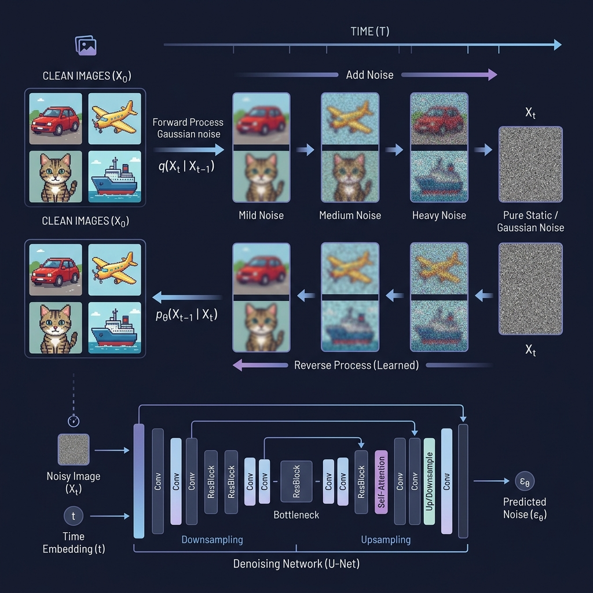

<div align="center">

# 🎨 DDPM — Denoising Diffusion Probabilistic Models

**A clean, modular PyTorch implementation of DDPM for CIFAR-10 image generation**




*Forward process gradually adds noise; the U-Net learns to reverse it.*

</div>

---

## 📖 Overview

This repository provides a **from-scratch implementation** of [Denoising Diffusion Probabilistic Models (DDPM)](https://arxiv.org/abs/2006.11239) using PyTorch. The model learns to generate realistic CIFAR-10 images by iteratively denoising Gaussian noise through a **U-Net** architecture with **sinusoidal timestep conditioning**.

The project also includes an evaluation pipeline using **Self-Supervised Learning (SSL)** with [rotation prediction (RotNet)](https://arxiv.org/abs/1803.07728) to measure the quality of generated representations.

### ✨ Key Features

- 🏗️ **Modular architecture** — Clean separation of U-Net, diffusion logic, and training
- 🔄 **Resumable training** — Full checkpoint support with optimizer state
- 🎨 **Standalone generation** — Generate any number of synthetic images from a checkpoint
- 📊 **Built-in evaluation** — SSL pre-training + linear probe on real CIFAR-10
- 📝 **Fully documented** — Comprehensive docstrings and type hints

---

## 🏗️ Architecture

```
                     ┌──────────────────────────────────────┐
                     │            U-Net Backbone            │
                     │                                      │
  Noisy Image ──►    │  Encoder        Decoder              │   ──► Predicted Noise
  (B, 3, 32, 32)     │  64→128→256    256→128→64            │      (B, 3, 32, 32)
                     │  →512→1024     ←512←1024             │
                     │       └── skip connections ──┘       │
  Timestep t ──►     │  SinusoidalEmb → MLP → inject       │
                     └──────────────────────────────────────┘
```

---

## 📂 Project Structure

```
DDPM/
├── ddpm/                   # Core package
│   ├── __init__.py         # Exports UNet, Diffusion
│   ├── unet.py             # U-Net architecture with time conditioning
│   ├── diffusion.py        # Forward/reverse diffusion processes
│   └── dataset.py          # RotationDataset for SSL evaluation
│
├── train.py                # 🏋️ Train the DDPM on CIFAR-10
├── generate.py             # 🎨 Generate synthetic images
├── evaluate.py             # 📊 SSL + linear probe evaluation
│
├── assets/                 # Images for README
├── requirements.txt
├── LICENSE
└── README.md
```

---

## 🚀 Quick Start

### Installation

```bash
git clone https://github.com/YOUR_USERNAME/DDPM.git
cd DDPM
pip install -r requirements.txt
```

### 1. Train the DDPM

```bash
# Default: 100 epochs, batch_size=128, lr=1e-3
python train.py

# Custom training
python train.py --epochs 200 --lr 2e-4 --batch_size 64 --timesteps 1000

# Resume from checkpoint
python train.py --resume checkpoints/ddpm_epoch_50.pt
```

Training saves:
- **Samples** → `ddpm_samples/epoch_XXX.png` (every 10 epochs)
- **Checkpoints** → `checkpoints/ddpm_epoch_XXX.pt` (resumable)

### 2. Generate Synthetic Images

```bash
# Generate 50k images (default)
python generate.py --checkpoint checkpoints/ddpm_final.pt

# Custom generation
python generate.py --checkpoint checkpoints/ddpm_final.pt \
    --num_images 10000 --batch_size 512 --output_dir my_images
```

### 3. Evaluate with SSL

```bash
# Evaluate representation quality
python evaluate.py --synthetic_dir synthetic_dataset_diffusion

# More training for better evaluation
python evaluate.py --ssl_epochs 100 --ft_epochs 30
```

---

## 🧠 How It Works

### Diffusion Process

The core idea of DDPM is simple but powerful:

1. **Forward process** — Gradually add Gaussian noise to images over `T` timesteps until the image becomes pure noise. This is a fixed (non-learned) Markov chain.

2. **Reverse process** — Learn a neural network (U-Net) that can predict the noise at each timestep. At generation time, start from pure noise and iteratively denoise.

```
Clean Image  ──►  x₁  ──►  x₂  ──►  ...  ──►  x_T  (Pure Noise)
     ◄── denoise ◄── denoise ◄── denoise ◄──  (Learned)
```

### Training Objective

The model minimizes the **mean squared error** between the actual noise added and the noise predicted by the U-Net:

```
L = || ε − ε_θ(x_t, t) ||²
```

Where `ε` is the true noise and `ε_θ` is the U-Net's prediction.

### Evaluation Pipeline

To measure **generation quality without FID**, we use a self-supervised approach:

1. Train a ResNet-18 on a **rotation prediction** task (RotNet) using only synthetic images
2. Freeze the backbone and train a **linear classifier** on real CIFAR-10
3. Higher accuracy ⟹ better visual features ⟹ higher quality generated images

---

## 📊 Hyperparameters

| Parameter | Default | Description |
|---|---|---|
| `timesteps` | 300 | Number of diffusion steps |
| `lr` | 1e-3 | Learning rate (Adam) |
| `batch_size` | 128 | Training batch size |
| `epochs` | 100 | Training epochs |
| `beta_start` | 0.0001 | Starting noise variance |
| `beta_end` | 0.02 | Ending noise variance |
| `time_emb_dim` | 32 | Timestep embedding dimension |

---

## 📚 References

- Ho, J., Jain, A., & Abbeel, P. (2020). [**Denoising Diffusion Probabilistic Models**](https://arxiv.org/abs/2006.11239). *NeurIPS 2020*.
- Gidaris, S., Singh, P., & Komodakis, N. (2018). [**Unsupervised Representation Learning by Predicting Image Rotations**](https://arxiv.org/abs/1803.07728). *ICLR 2018*.
- Ronneberger, O., Fischer, P., & Brox, T. (2015). [**U-Net: Convolutional Networks for Biomedical Image Segmentation**](https://arxiv.org/abs/1505.04597). *MICCAI 2015*.

---

## 📄 License

This project is licensed under the [MIT License](LICENSE).

---

<div align="center">

**Made with 💜 by [Gabriel Yogi](https://github.com/YOUR_USERNAME)**

</div>
